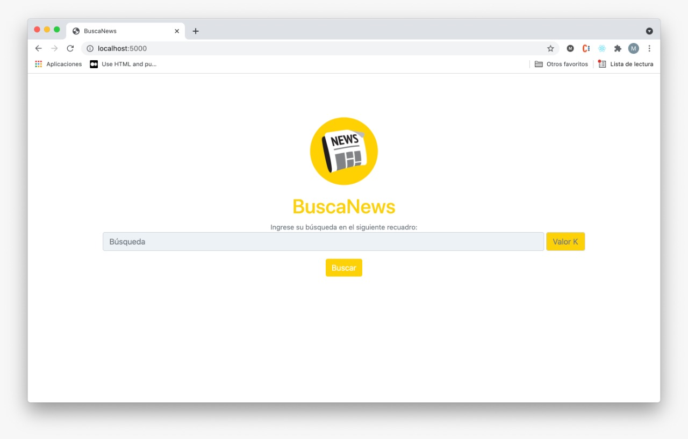

# Proyecto 2 - Recuperación de Documentos de Texto

## Datos generales

### Integrantes

- Andrea Díaz
- Diego Cánez
- Maor Roizman

## Descripción

### Objetivo del Proyecto

### Descricpión del Dominio de Datos

`Kaggle Dataset:` [All The News](https://www.kaggle.com/snapcrack/all-the-news)

## Funcionamiento

```python
DiskInvertedIndex.__init__(datapath: Path, cached=False)
```

El Indice invertido toma como argumento el folder de la data. Si la data se ha indexado anteriormente, la opcion `cached=True` le indica que no recompute el indice de nuevo.

Usando block-based sorting, la construccion del inverted index es en dos partes:

1. Partition/Map: Se crean indices temporales en disco, cada uno habiendo procesado `B` documentos distintos. Los documentos se preprocesan con las funcion `clean_text`.
2. Reduce: De dos en dos se hace merge de los indices temporales en uno solo. 

Como se procesa un documento a la vez, no se sobrecarga la memoria principal. 


El esquema de pesos del tfidf utilizado es el siguiente:

```
w(t, d) = log(1 + tf(t, d)) * log(1 + N / df(t))
```

El logaritmo es usado para evitar algun bias a documentos grandes. Dicho tfidf se normaliza y se guarda en el indice invertido final para no recomputarlo. 

### Consultas

Se usa el algoritmo visto en clase para computar la distancia coseno. Recordamos que este hace 1 lectura en disco y corre en tiempo lineal al numero de documentos que contiene las palabras en el query. El parametro `k` indica la cantidad de elementos a ser retornados.

```python
DiskInvertedIndex.query(qtext: str, k: int)
```

### Stress-testing

|                              | 1000 noticias | 10000 noticias| 20000 noticias|
|------------------------------|--------|---------|---------|
| Index Construction (5 tests) | 14.659 s| 141.359 s| 200.592 s|
| KNN Query (5 tests)          | 0.273 s| 2.464 s| 3.288 s|

### API

> Buscar todos los tweets relevantes.
- `Method:` GET
- `Parameters:` **text**=Lorem Ipsum...
- `Response:`
```
{
  {
    "id": 1,
    "title": "",
    "publication": "",
    "author": "",
    "date": "",
    "text": "",
    "year": 2016.0,
    "month": 12.0,
    "content": "Lorem Ipsum..."
   },
   ...
}
```

## Frontend




## Demostración
